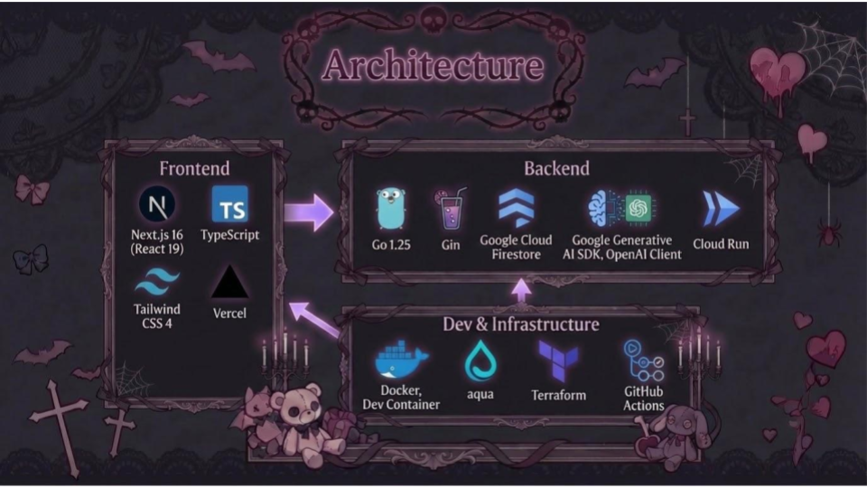

  
  <h1>きらくじ</h1>
  
誰かの闇を引いてみよう🔎

  <a href="https://kiraku-ji.vercel.app/" target="_blank">デプロイURL</a>
  <a href="https://docs.google.com/presentation/d/1BjNBlhjkQwgbfOsfBuCQpYGVe743BDImZHMwZ0j5m1s/edit?slide=id.g3b2dc0bfc4d_6_3#slide=id.g3b2dc0bfc4d_6_3" target="_blank">プレゼン資料</a>

 

  
  
  
  
  
  
  
  
  
  
  
  
  

  <h2>Architecture</h2>
  

